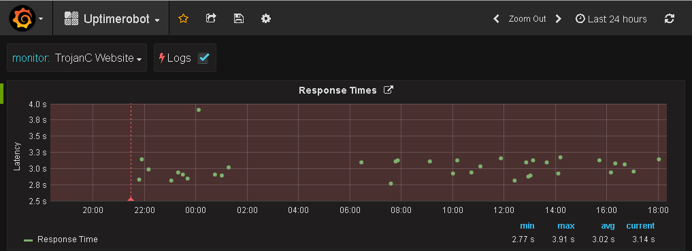

# node-influx-uptimerobot
A tool to get statistics from uptimerobot and log it into influxdb

## Configuration
Place config in `config.json` or pass a parameter with the location of the config
file to use.

```json
{
  "uptimerobot" : {
    "apikey" : "uxxxxxx-xxxxxxxxxxxxxxxxxxxxxxxx"
  },
  "influx" : {
    "host" : "localhost",
    "port" : 8086,
    "protocol" : "http",
    "username" : "admin",
    "password" : "admin",
    "database" : "uptimerobot"
  }
}
```
- **uptimerobot.apikey** Your uptimerobot API key.
- **influx.host** Hostname or IP of your influxdb server.
- **influx.port** Hostname or IP of your influxdb server.
- **influx.protocol** protocol for your influxdb server.
- **influx.username** Username for your influxdb server.
- **influx.password** Password for your influxdb server.
- **influx.database** Name of the influxdb database to use

## Dashboard


Import the contents of `grafana-uptimerobot-dashboard.json` to grafana and update
your data sources as required to have them linked up.
